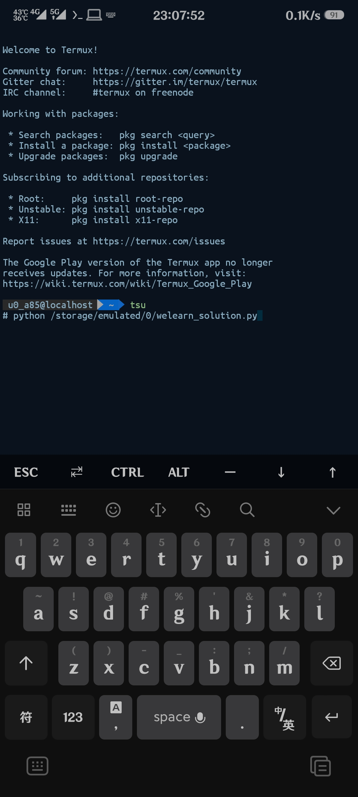
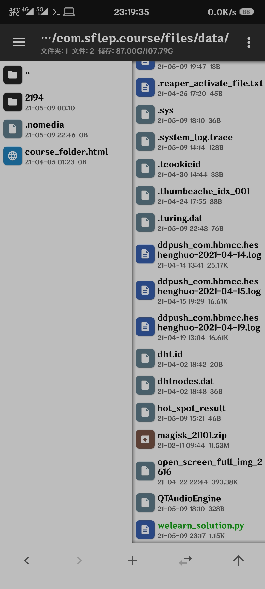
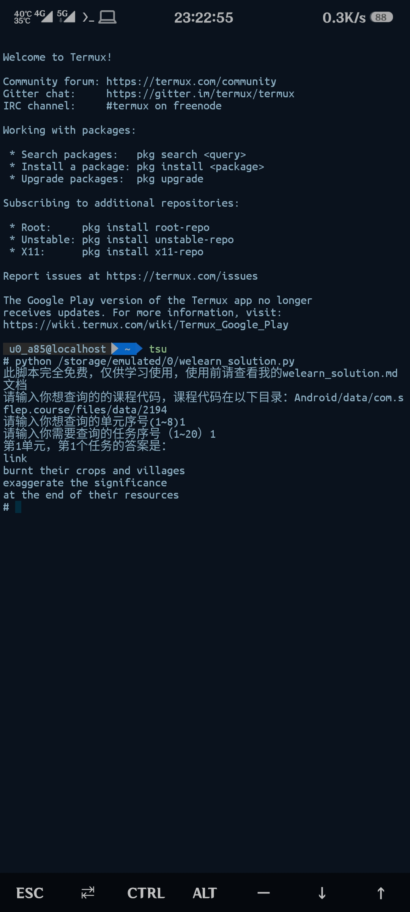

# welearn 随行课堂 Android 端答案提取

## 使用须知

本脚本仅适用于**Android**端，本人写这个脚本的初衷只是为了方便自己，不用去反复翻答案目录去找关键词，当然不支持班级测试，班级测试老老实实的自己做，或者网上找答案。

本脚本使用**Python**编写，所以请确保手机安装了Python环境，因为笔者懒得封装，也没有了解过Python在Android端的封装，所以就凑合着用吧🤣。请确保你的手机符合以下条件：

1. 你的手机安卓版本在安卓10以下，如果是安卓11以上，请确保你的手机已经获取了root权限，这是因为Google在安卓11以上的版本限制了/storage/emulated/0/Android/data/目录的访问，目前安卓11除了Google原生安卓文件管理器能访问以外，只有获取root权限才能访问。

2. 请在手机上安装Python环境，目前比较好用的是[QPython](https://www.coolapk.com/apk/com.hipipal.qpyplus)和[Termux](https://www.coolapk.com/apk/com.termux)。笔者用的是Termux，Termux是一个高级终端，在里面可以不仅可以安装python环境，甚至可以安装主流的Linux操作系统，比如CentOS和Ubuntu，值得注意的是，如果你是安卓11，那么建议使用Termux，因为获取root权限方便，QPython笔者也试过，但开启root之后就调用不了库，原因未知；笔者的手机是安卓11，那么我会以Termux为例来讲如何使用此脚本。

下面让我们进入正题：

----------

## 使用教程

1. 首先在酷安下载[Termux](https://www.coolapk.com/apk/com.termux)，也可在[Google play](https://play.google.com/store/apps/details?id=com.termux)或者[Termux官网](https://f-droid.org/packages/com.termux/)下载，有条件当然推荐Google play版本，国内自然是酷安更好（可以在酷安评论区找到play版本）。安装完成并打开，国内建议换成清华大学镜像源，毕竟官方的源在国外还是比较慢的。输入以下命令换成清华大学源。

   ```bash
   sed -i 's@^\(deb.*stable main\)$@#\1\ndeb https://mirrors.tuna.tsinghua.edu.cn/termux/termux-packages-24 stable main@' $PREFIX/etc/apt/sources.list
   
   sed -i 's@^\(deb.*games stable\)$@#\1\ndeb https://mirrors.tuna.tsinghua.edu.cn/termux/game-packages-24 games stable@' $PREFIX/etc/apt/sources.list.d/game.list
   
   sed -i 's@^\(deb.*science stable\)$@#\1\ndeb https://mirrors.tuna.tsinghua.edu.cn/termux/science-packages-24 science stable@' $PREFIX/etc/apt/sources.list.d/science.list
   
   pkg update
   ```

2. 然后输入`pkg install python`安装Python，接着输入`pip install bs4`安装bs4库。
3. 将下载下来的 welearn_solution.py 文件放入任意目录，最好是根目录，这样方便找，也方便调用，但是会让根目录不美观。
4. 非root用户可直接跳到第5步，对于安卓11的root用户，在执行第5步之前，需要让termux获取root权限，在终端输入以下命令`pkg install tsu`安装termux su，这是真正的root权限，然后输入tsu进入超级用户模式，此时面具应该会弹出root授权的窗口，如果不是在这就是下一步，点击授权即可。
5. 在终端输入 `python /storage/emulated/0/welearn_solution.py ` 执行脚本，如果你的文件放在别的目录下，请将文件夹名称加入到 `/storage/emulated/0/` 的后面。
6. 执行脚本后会弹出提示，让你输入课程代码，课程单元，以及课程任务序号。课程代码是`/storage/emulated/0/Android/data/com.sflep.course/files/data/`的四位数文件夹，例如《全新版大学英语综合教程4》的课程代码是2194，3是2193，具体视情况而定。课程单元就是你想查询的单元序号，第一单元就是1；任务序号就是页面数，第一个任务就是1，这两个序号的范围我限制在1-8和1-20之间，通常英语课本就这么多单元吧🤣，如果有超出的单元或任务，可以自行修改代码范围，在两个for循环的区间的括号内，回车之后，然后就一路顺畅的获得答案。